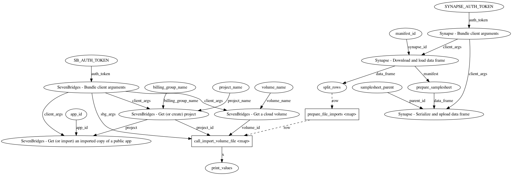

# Sage Prefect Tasks

<!--
[](https://sagetasks.readthedocs.io/en/stable/)
[](https://pypi.org/project/sagetasks/)
-->

⚠️ **Warning: This repository is a work in progress.** ⚠️

Python package of useful Prefect tasks for common use cases at Sage Bionetworks.

Some thoughts are included below the Demo Flow and Usage.

Inspired by [Pocket/data-flows](https://github.com/Pocket/data-flows).

## Demo Flow



## Demo Usage

### Getting access

To run this demo, you'll need the following access:

- You need to ask Bruno for edit-access on the [INCLUDE Sandbox](https://www.synapse.org/#!Synapse:syn31937702/wiki/) Synapse project.
- You need to ask Bruno for edit-access on the [include-sandbox](https://cavatica.sbgenomics.com/u/bgrande/include-sandbox) Cavatica project.

### Getting set up

```sh
# Create a virtual environment with the Python dependencies
pipenv install

# Copy the example `.env` file and update the auth tokens
cp .env.example .env
```

### Run the flow at the command line

You'll need to [get set up](#getting-set-up) first.

```sh
# Run the demo (pipenv will automatically load the `.env` file)
pipenv run python demo.py
```

### Inspect the flow using the Prefect Server UI

You'll need to [get set up](#getting-set-up) first.

```sh
# Deploy Prefect Server (Orion)
prefect orion start

# Explore the flow runs in Prefect Server
# Usually hosted at http://127.0.0.1:4200/

# Stop the running server with Ctrl-C
```

## Thoughts

- The `CavaticaBaseTask` demonstrates a use case for classes (_i.e._ extending `Task`) as opposed to functions (_i.e._ decorated by `@task`). On the other hand, `SynapseBaseTask` doesn't really benefit from the class structure.

- The SevenBridges Python client embeds the client instance into every resource object, which prevents `cloudpickle` to serialize these objects due to `TypeError: cannot pickle '_thread.lock' object`.

  ```python
  import os
  import cloudpickle
  import sevenbridges as sbg

  api = sbg.Api(
      url="https://cavatica-api.sbgenomics.com/v2", token=os.environ["SB_AUTH_TOKEN"]
  )
  proj = api.projects.query(name="include-sandbox")[0]
  proj._API = None
  proj._api = None
  proj._data.api = None
  pickle = cloudpickle.dumps(proj)
  ```

## Note

This project has been set up using PyScaffold 4.3. For details and usage
information on PyScaffold see https://pyscaffold.org/.
